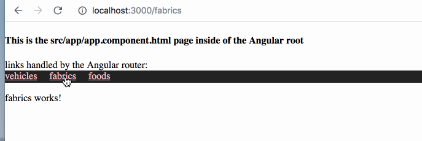

# README

January 9, 2019 

This is very simple app showing and Angular page with routing running inside of Rails 5. 

Stack: 

* Rails 5.2.2
* Ruby 2.5.1p57
* Angular 7 

## What we want: 

We want an app that can serve Rails pages and also single page app pages with Angular

## Setup

Essentially what we've done here 

1. We created a new Rails app using Rails new 
2. We scaffoled a controller in Rails called spa ( standing for 'single page app', not a pampering salon). 
3. We scaffoled a pages route for Rails routes called pages. 
4. We then created a 'catch all' route in routes.rb at the end of all routes (placement matters), 
that handles all requests . Note that all routes ABOVE the catch all at the end are served by Rails.  

```
Rails.application.routes.draw do

  get '/pages', to: "pages#index"

  get '*path',  to: 'spa#index'

end


```

Then I installed Angular 7 in the root of the Rails app 
and named that Angular installation "client"

When you compile Angular ( this is  important), it dumps the compiled files into /client/dist/client

I then went into the views folder and deleted the /spa folder. 

Then I created a sym link to a new /spa folder as such: 

> ln -s ../../client/dist/client  /spa 


What this does is that when Rails looks for the spa/index page it actually gets the sym linked Angular root folder. 

Then run the Angular server locally within the client folder

> ng serve

And BUILD the angular app ( super important... otherwise the compiled files wont' show up in the dist folder )

> ng build 

and Also run the rails server

> rails s 


## final step 
Finally, we delete the public folder at the Rails root and replace this with a sym link to our client/dist/client folder: 

> ln -s client/dist/client public

### What this does: 

Rails, when it cannot match a route, will fall back to serving files within the public folder. We have two places sym linked to the client/dist/client folder... the /spa page which Rails looks for when hitting the "spa" route, and the public folder which is what will serve the ASSETS (mainly javascript files) associated with the index.html page that's being served by Angular. 


And now if you visit the Rails route: 

> localhost:3000/pages

you get your Rails route, but if you hit anything else : 

> localhost:3000/whatever 

you get to the Angular root. Angular can then serve it's own pages with syntax like  
> <a routerLink="myplace"> my place </a> 

and you'll get your pages served within the single page Angular app. 





## LASTLY
ALWAYS REMEMBER TO DO * ng build * to see the new compiled changes to your Angular app within the Rails app.  ng build dumps a new set of files into _client/dist/client_ and that's what will show.  

It may feel cumbersome to do _ng build_ after every change. In this case, I recommend just running ng serve, viewing your Angular changes in port 4200, and when you're ready to see it all working within the Rails app, do the ng build at that time. 

To do a production build for Angular using ng build --prod, see the Angular documentation. 


