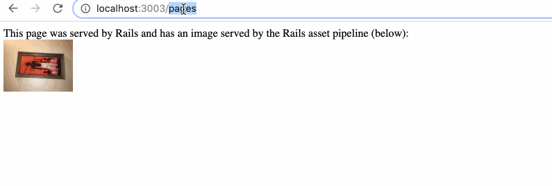

# README

January 9, 2019 

This is very simple app showing and Angular page with routing running inside of Rails 5. 

Stack: 

Rails 5.2.2
Ruby 2.5.1p57
Angular 7 

Process: 

Essentially what we've done here is scaffold a new controller in Rails called spa. 
Then I created a 'catch all' route in routes.rb at the end of all routes (placement matters), 
that handles all requests . 

> get '*path',  to: 'spa#index'

Then I installed Angular 7 in the root of the Rails app 
and named that Angular installation "client"

When you compile Angular ( this is  important), it dumps the compiled files into /client/dist/client

I then went into the views folder and deleted the /spa folder. 

Then I created a sym link to a new /spa folder as such: 

> ln -s ../../client/dist/client  /spa 

What this does is that when Rails looks for the spa/index page it actually gets the sym linked Angular root folder. 

Then run the Angular server locally within the client folder

> ng serve

and Also run the rails server

> rails s 

And now if you visit the Rails route: 

> localhost:3000/pages

you get your Rails route, but if you hit anything else : 

> localhost:3000/whatever 

you get to the Angular root. Angular can then serve it's own pages with syntax like  
> <a routerLink="myplace"> my place </a> 

and you'll get your pages served within the single page Angular app. 

